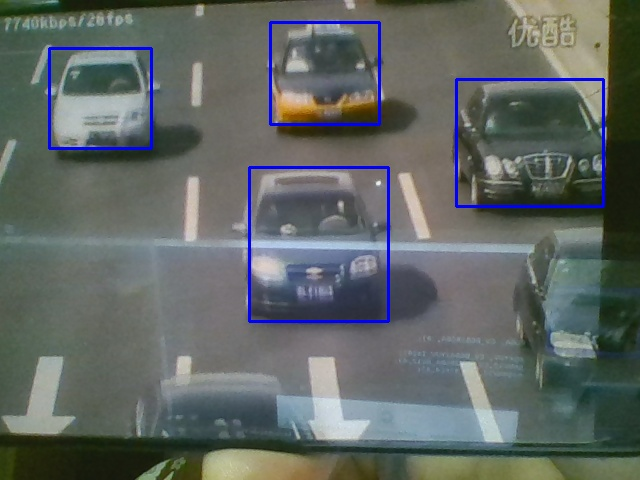

# tensorSSD
Deep-Learn model SSD_300x300 transplante to TensorRT(Nvidia Jetson Tx2)


 * #### include header file  
```
#include "TensorSSD.h"
```
 * #### create TensorSSD object and initialize it
```
		//create tensorSSD
		TensorSSD* tensorSSD = new TensorSSD();
		//initialize with dimension of the input
		tensorSSD->initialize(1280,720);
```

 * #### convert SSD model to tensorRT model cache
``` 
tensorSSD->convertCaffeSSDModel("SSD.prototxt", "SSD.model", "trtModel.cache")
 
```
 NOTE: you should modify the deploy file to remove or comment the item that tensorRT not supported


 * #### load cached model file  
```
		//load model cached file & get cached file size
		int cacheSize = tensorSSD->loadTensorSSDModel("./trtModel.cache",&cacheSize);
```

 * #### prepare before inference
```
		//prepare execution with confidence threshold (0~1.0)
		tensorSSD->prepareInference(0.9);
```

 * #### do inference 
     must in a video or image process loop   
```
		//a vector that detected objects will be received
		vector<Rect> rectList;
		//do inference with a image(RGBA)
		tensorSSD->imageInference( (float4*)imgRGBA, &rectList);

		Rect rect;
		//print detected objects
		for(int i=0;i<rectList.size();i++){
			rect = rectList[i];
			printf("Object detected %d: x = %d y = %d width = %d height =  d\n",i,rect.x,rect.y,rect.width,rect.height);

		}
```


 * #### Demo

	 * Ubuntu16.04,Cuda9.0,NV GEFORCE gtx 1060 on PC(x86_64)
	 * USB camera, mp4 file play on a smart phone.


